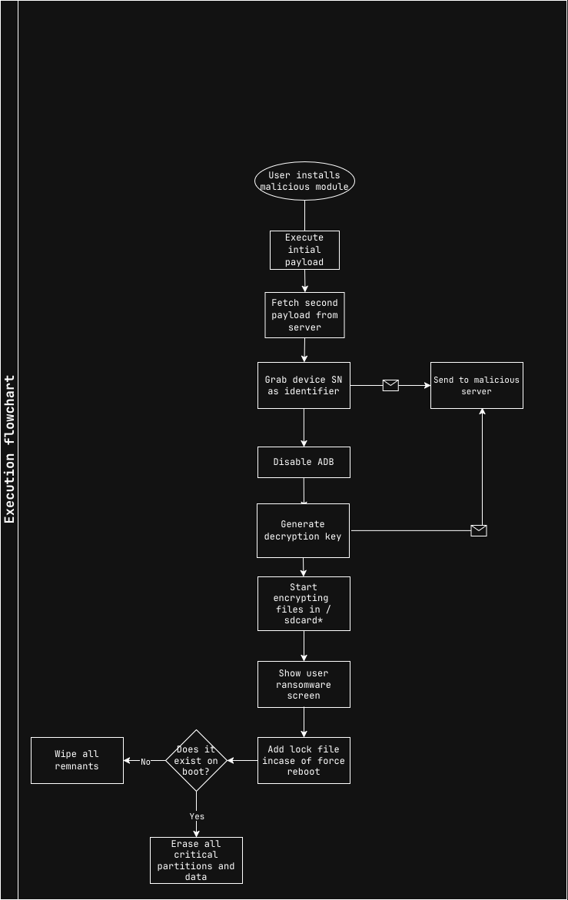

# ShoujoCrypt
#### A moe-themed proof-of-concept Android ransomware

## Prologue
*ShoujoCrypt* is a [Proof-of-Concept](https://en.wikipedia.org/wiki/Proof_of_concept) [ransomware](https://en.wikipedia.org/wiki/Ransomware) targetting [Android](https://en.wikipedia.org/wiki/Android_(operating_system)) *root users* by hiding a payload inside a [Magisk](https://github.com/topjohnwu/Magisk) module.

# Execution flow

# Acknowledgements
- [Rem01Gaming](https://github.com/Rem01Gaming) for helping me with Android NDK

# Licensing
This project is under the public domain by [Unlicense](https://unlicense.org/).

# Dependencies
- [curl](https://curl.se/libcurl/) ([license](https://curl.se/docs/copyright.html))
- [OpenSSL](https://openssl-library.org/) ([license](https://raw.githubusercontent.com/openssl/openssl/refs/heads/master/LICENSE.txt))